# Using Microsoft Azure Active Directory for Authentication with SharePoint Server 2016

Learn how to use the Azure Access Control Service to authenticate your SharePoint Server 2016 users with Azure Active Directory.

> This article refers to code samples for interacting with Azure AD Graph. [Sample PowerShell scripts](scripts/readme.md) are available online to accompany this article.

SharePoint Server 2016 provides the ability to authenticate users using claims-based authentication, making it easy to manage your users by authenticating them with different identity providers that you trust but someone else manages. For example, instead of managing user authentication through Active Directory Domain Services (AD DS), you could enable users to authenticate using Azure Active Directory (Azure AD). This enables authentication for cloud-only users with the onmicrosoft.com suffix in their username, users synchronized with an on-premises directory, and invited guest users from other directories. It also enables you to take advantage of Azure AD features such as conditional access, multi-factor access support, conditional access policies, and advanced reporting capabilities.

This article explains how you can use Azure AD to authenticate your users instead of your on-premises AD DS. In this configuration, Azure AD becomes a trusted identity provider for SharePoint Server 2016. This configuration adds a user authentication method that is separate from the AD DS authentication used by the SharePoint Server 2016 installation itself. To benefit from this article, you should be familiar with WS-Federation. For more information, see [Understanding WS-Federation](https://go.microsoft.com/fwlink/p/?linkid=188052).

Previously, this configuration would have required a federation service such as Azure Access Control Service (ACS) in the cloud or an environment that hosts Active Directory Federation Services (AD FS) to transform tokens from SAML 2.0 to SAML 1.1. This transformation is no longer required as Azure Active Directory now enables issuing SAML 1.1 tokens. The following figure shows how authentication works for SharePoint 2016 users in this configuration, demonstrating that there is no longer a requirement for an intermediary to perform this transformation.

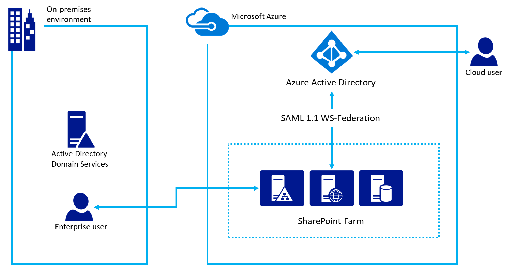

*Figure 1 - Using Azure Active Directory for SharePoint 2016 Authentication*

Note that this configuration works whether the SharePoint farm is hosted in Azure virtual machines or on-premises. It does not require opening additional firewall ports other than ensuring users can access Azure Active Directory from their browser.
For information about SharePoint 2016 accessibility, see [Accessibility Guidelines in SharePoint Server 2016](https://go.microsoft.com/fwlink/p/?LinkId=393123).

## Configuration overview
Follow these general steps to set up your environment to use Azure AD as a SharePoint Server 2016 identity provider.

1.	Ensure the zone for the web application that you want to secure with Azure AD is configured to use SSL.
2.	Create a new Azure AD directory or use your existing directory.
3.	Create a new enterprise application in Azure AD.
4.	Configure a new trusted identity provider in SharePoint Server 2016.
5.	Set the permissions for the web application.
6.	Add a SAML 1.1 token issuance policy in Azure AD.
7.	Verify the new provider.

## Create a new Azure AD directory or use your existing directory
In the [Azure Portal](https://portal.azure.com/), create a new directory. Provide the organization name, initial domain name, and the country or region. 

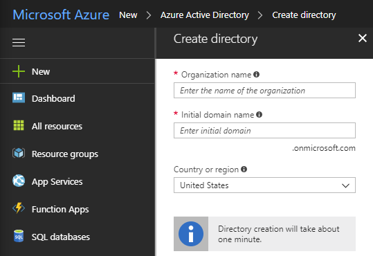

*Figure 2 - Create a directory*

If you already have a directory such as the one used for Microsoft Office 365 or your Microsoft Azure subscription, you can use that directory instead. You must have permissions to register applications in the directory.

## Ensure the zone for the web application that you want to secure with Azure AD is configured to use SSL
This article was written using the reference architecture [Run a high availability SharePoint Server 2016 farm in Azure](https://docs.microsoft.com/en-us/azure/architecture/reference-architectures/sharepoint/). The article’s accompanying scripts used to [deploy the solution](https://docs.microsoft.com/en-us/azure/architecture/reference-architectures/sharepoint/) create a site that does not use SSL.  

Using SAML requires the application be configured to use SSL. If your SharePoint web application is not configured to use SSL, use the following steps to create a new self-signed certificate to configure the web application for SSL. This configuration is only meant for a lab environment and is not intended for production. Production environments should use a signed certificate.

1.	In **Central Administration**, navigate to **Application Management > Manage Web Applications** and choose the web application that needs to be extended to use SSL. **Select** the web application and click the **Extend** ribbon button. Extend the web application to use the same URL but use SSL with port 443.

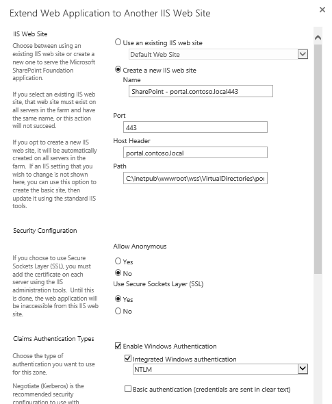

*Figure 3 - Extend the web application to another IIS web site.*
2.	In IIS Manager, double-click Server Certificates.
3.	In the Actions pane, click Create Self-Signed Certificate. Type a friendly name for the certificate in the Specify a friendly name for the certificate box, and then click OK.
4.	From the Edit Site Binding dialog box, ensure the host name is the same as the friendly name, as illustrated in figure 4.
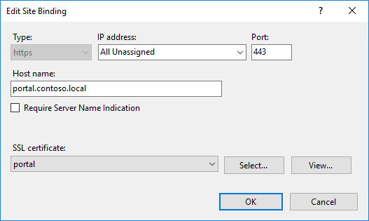

*Figure 4 - Edit site binding in IIS.*

Each of the web front end servers in the SharePoint farm will require configuring the certificate for the site binding in IIS.

## Create a new enterprise application in Azure AD
In the [Azure Portal](https://portal.azure.com/), open your Azure AD directory. Click **Enterprise Applications**, then click **New application**. Choose **Non-gallery application**. Provide a name such as “SharePoint SAML Integration” and click **Add**.


*Figure 5 - Add a new non-gallery application.*

Click the **Single sign-on link** in the navigation pane to configure the application. Change the **Single Sign-on Mode** dropdown to **SAML-based Sign-on** to reveal the SAML configuration properties for the application. Configure with the following properties:
- Identifier: `urn:sharepoint:portal.contoso.local`
- Reply URL: `https://portal.contoso.local/_trust/default.aspx`
- Sign-on URL: `https://portal.contoso.local/_trust/default.aspx`
- User Identifier: `user.userprincipalname`

> Note: the URLs above should be changed, replacing `portal.contoso.local` to point to the URL of the SharePoint site you wish to secure.

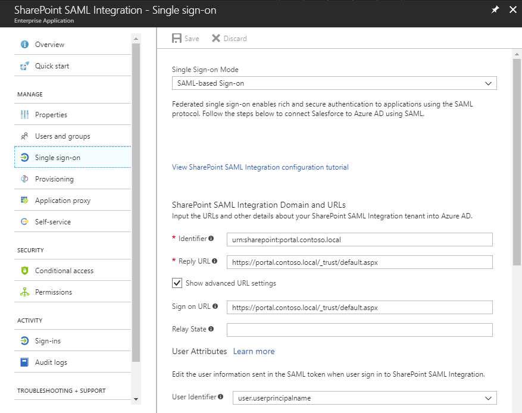

*Figure 6 - Configure single sign-on.*

Copy the `Identifier` value into the `Realm` property in **Table 1** below.

After configuring settings, make sure to Save changes.

Click the **Configure `<app name>`** link to access the **Configure sign-on** page.  

- Click the **SAML Signing Certificate - Raw** link to download the SAML Signing Certificate as a file with the .cer extension. **Copy** the full path to the downloaded file into **Table 1** below.
- **Copy** the **SAML Single Sign-On Service URL** link into the table below, replacing the `/saml2` portion of the URL with `/wsfed`. 

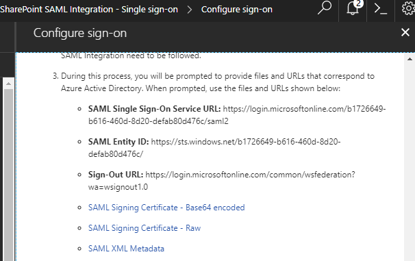

*Figure 7 - Configure single-sign on page.*

Navigate to the **Properties pane** for the application. Copy the `Object ID` value into **Table 1** below.

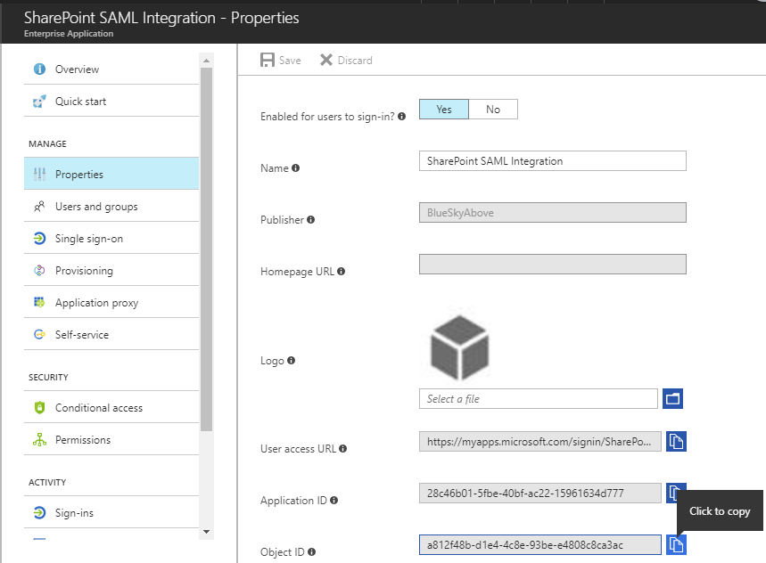

*Figure 8 - Properties pane for the application*

Using the values captured above, capture the required configuration values into **Table 1** below.

Description | Value 
--- | --- 
**Realm** |  
**Full path to SAML signing certificate file** | 
**SAML single sign-on service URL (replace /saml2 with /wsfed)** | 
**Application Object ID** | 

*Table 1 - Capture required configuration values.*

An example of the values is shown in Table 2.

Description | Value 
--- | --- 
**Realm** | `urn:sharepoint:portal.contoso.local`
**Full path to SAML signing certificate file** | `C:/temp/SharePoint SAML Integration.cer`
**SAML single sign-on service URL (replace /saml2 with /wsfed)** | `https://login.microsoftonline.com/b1726649-b616-460d-8d20-defab80d476c/wsfed`
**Application Object ID** | `a812f48b-d1e4-4c8e-93be-e4808c8ca3ac`

*Table 2 - Example of values to capture into Table 1 above.*

> Note that it is important to replace the `/saml2` value in the URL with `/wsfed`. The `/saml2` endpoint will only process SAML 2.0 tokens, while the `/wsfed` endpoint enables processing SAML 1.1 tokens and is required for SharePoint 2016 SAML federation.

## Configure a new trusted identity provider in SharePoint Server 2016
Log into the SharePoint Server 2016 server and open the **SharePoint 2016 Management Shell**. Run the following commands to configure a new trusted identity provider.

````powershell
$cert = New-Object System.Security.Cryptography.X509Certificates.X509Certificate2("<File path from Table 1>")
New-SPTrustedRootAuthority -Name "AzureAD" -Certificate $cert
$map = New-SPClaimTypeMapping -IncomingClaimType "http://schemas.xmlsoap.org/ws/2005/05/identity/claims/name" -IncomingClaimTypeDisplayName "name" -LocalClaimType "http://schemas.xmlsoap.org/ws/2005/05/identity/claims/upn"
$map2 = New-SPClaimTypeMapping -IncomingClaimType "http://schemas.xmlsoap.org/ws/2005/05/identity/claims/givenname" -IncomingClaimTypeDisplayName "GivenName" -SameAsIncoming
$map3 = New-SPClaimTypeMapping -IncomingClaimType "http://schemas.xmlsoap.org/ws/2005/05/identity/claims/surname" -IncomingClaimTypeDisplayName "SurName" -SameAsIncoming
$realm = "<Realm from Table 1>"
$ap = New-SPTrustedIdentityTokenIssuer -Name "AzureAD" -Description "SharePoint secured by Azure AD" -realm $realm -ImportTrustCertificate $cert -ClaimsMappings $map,$map2,$map3 -SignInUrl "<wsfed url from Table 1>" -IdentifierClaim "http://schemas.xmlsoap.org/ws/2005/05/identity/claims/name"
````

Use the following steps to enable the trusted identity provider for your application.
1.	In **Central Administration**, navigate to **Manage Web Application** and **select** the web application that you wish to secure with Azure AD. 
2.	**Click** the **Authentication Providers** ribbon button and choose the zone that you wish to use.
3.	Select **Trusted Identity provider** and select the identify provider you just registered named `AzureAD`.  
4.	On the sign-in page URL setting, select Custom sign in page and provide the value `/_trust/`. 
5.	Click OK.

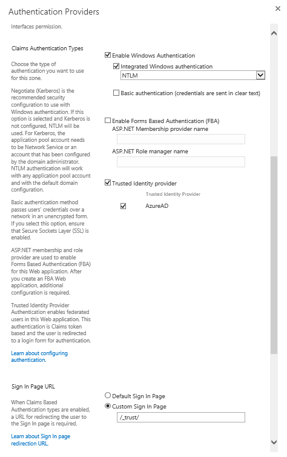

*Figure 9 - Configure authentication provider.*

## Set the permissions 
The users who will log into Azure AD and access SharePoint must be granted access to the application. 
1.	In the [Azure Portal](https://portal.azure.com/), open the Azure AD directory. Click **Enterprise Applications**, then click **All applications**. Click the application that you created previously (`SharePoint SAML Integration`).
2.	Click **Users and Groups**. 
3.	Click **Add user** to add a user or group who will have permissions to log into SharePoint using Azure AD.
4.	Select the user or group then click **Assign**.

The user has been granted permission in Azure AD, but also must be granted permission in SharePoint. Use the following steps to set the permissions to access the web application.
1.	In **Central Administration**, click **Application Management**.
2.	On the **Application Management** page, in the **Web Applications** section, click **Manage web applications**.
3.	Click the appropriate web application, and then click **User Policy**.
4.	In **Policy for Web Application**, click **Add Users**.
5.	In the **Add Users** dialog, click the appropriate zone in **Zones**, and then click **Next**.
6.	In the **Policy for Web Application** dialog box, in the **Choose Users** section, click the **Browse** icon.
7.	In the **Find** textbox, type the exact sign-in name for a user in your directory and click **Search**. For example, `demouser@blueskyabove.onmicrosoft.com`.
8.	Under the **AzureAD** heading in the list view, select the **name** property, click **Add**, then click **OK** to close the dialog.
9.	In **Permissions**, click **Full Control**.
10.	Click **Finish**, then click **OK**.

The following figure illustrates the **Add Users** section of an existing web application.

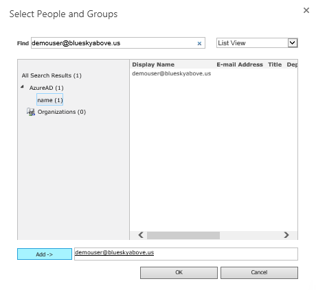

*Figure 10 - Search for a user by their name claim.*


*Figure 11 - Grant full control to a claims user.*

## Add a SAML 1.1 token issuance policy in Azure AD
When the Azure AD application is created in the portal and configured for single-sign on using SAML, it defaults to using SAML 2.0. SharePoint Server 2016 requires the SAML 1.1 token format. The Azure AD Graph enables creation of Token Issuance Policies that use the SAML 1.1 token format. At the time of this writing, this capability is not exposed in the portal and must be configured using the Azure AD Graph.

This article provides [accompanying sample scripts](scripts/readme.md) that demonstrate how to interact with the Azure AD Graph endpoint via PowerShell to create a policy and assign it to a principal. The following sample script will remove the default SAML 2.0 policy and add a new policy to issue SAML 1.1 tokens.

````powershell
Import-Module <file path of Initialize.ps1> 

$objectid = "<Application Object ID from Table 1 above>"
$saml2policyid = Get-PoliciesAssignedToServicePrincipal -servicePrincipalId $objectid | ?{$_.displayName -EQ "TokenIssuancePolicy"} | select objectId
#Remove the existing SAML 2.0 policy
Remove-PolicyFromServicePrincipal -policyId $saml2policyid -servicePrincipalId $objectid
#Add the new SAML 1.1 policy
$policy = Add-TokenIssuancePolicy -DisplayName SPSAML11 -SigningAlgorithm "http://www.w3.org/2001/04/xmldsig-more#rsa-sha256" -TokenResponseSigningPolicy TokenOnly -SamlTokenVersion "1.1"
Set-PolicyToServicePrincipal -policyId $policy.objectId -servicePrincipalId $objectid
````
For more details on Token Issuance Policies, see the [Graph API reference for operations on policy](https://msdn.microsoft.com/en-us/library/azure/ad/graph/api/policy-operations#create-a-policy). 

## Verify the new provider
Open a browser to the URL of the web application that you configured in the previous steps. You are redirected to sign into Azure AD.

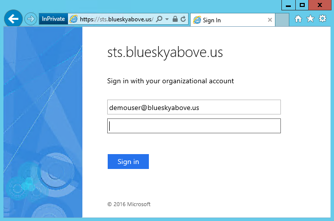

*Figure 12 – Example sign into Azure AD configured for federation. Azure AD supports cloud-only users and invited guest users in the directory.*

If enabled in your directory's branding settings, you are asked if you want to stay signed in.

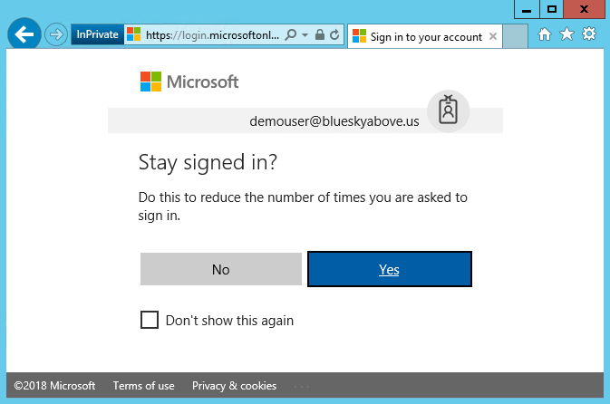

*Figure 13 - Reduce the number of times you are asked to sign in.*

Finally, you can access the site logged in as a user from your Azure Active Directory tenant.

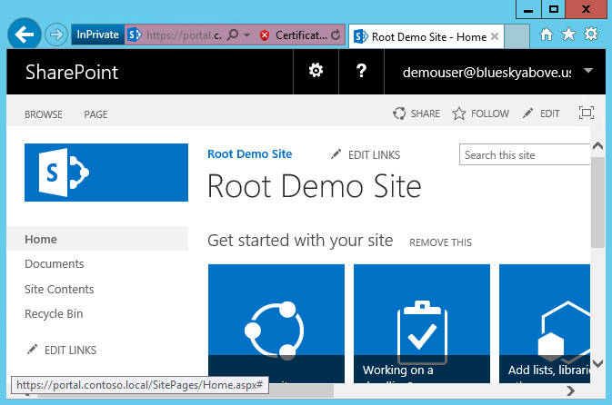

*Figure 14 - User signed into SharePoint after authenticating with Azure AD.*

## Fixing People Picker
Users can now log into SharePoint 2016 using identities from Azure AD, however there are still opportunities for improvement. For instance, searching for a user presents multiple search results in the people picker. This is because there is a search result for each of the 3 claim types that were created in the claim mapping. To add a user, you must type their user name exactly and choose the **name** claim result.

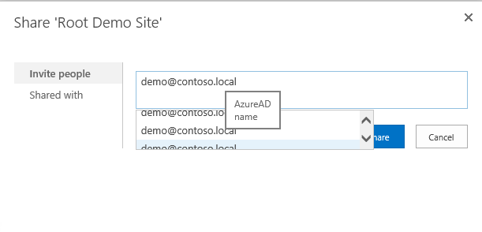
*Figure 15 - Claims search results showing multiple claims.*

There is no validation on what you type, which can lead to user misspellings that prevents users from successfully signing in, or users accidentally choosing the wrong claim type to assign such as the **SurName** claim. 

To assist with this scenario, there is an open-source solution called [AzureCP](https://yvand.github.io/AzureCP/) that provides a custom claims provider for SharePoint 2016. It will use the Azure AD Graph to resolve what users enter and perform validation. Learn more at [AzureCP](https://yvand.github.io/AzureCP/). 


